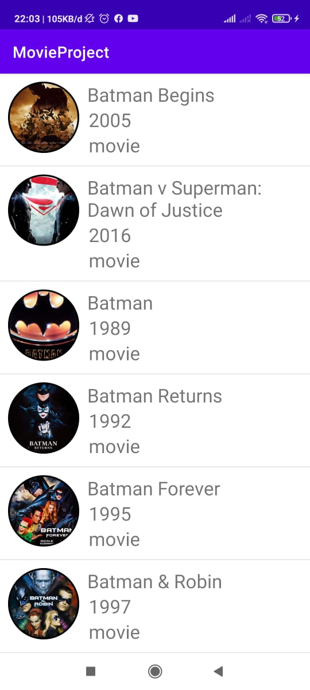
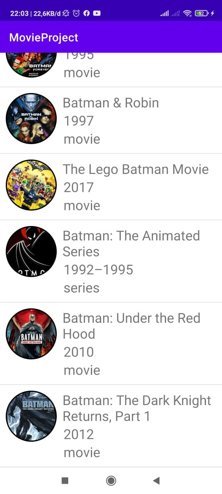

# MovieProject
Feature pada aplikasi

- Rest api Okhtpp dan Retrofit
- card view
- Recycler view

# API
API atau Application Programming Interface adalah sebuah interface yang dapat menghubungkan aplikasi satu dengan aplikasi lainnya. Jadi, API berperan sebagai perantara antar berbagai aplikasi berbeda, baik dalam satu platform yang sama atau lintas platform

# REST API
Prinsip kerja dari REST API ini adalah client akan menganggap server sebagai object yang dapat dibuat, diupdate, dihapus dan juga dibaca. Jadi pada pelaksanaannya akan ada create dengan request POST, update dengan request PUT atau PATCH, hapus dengan request DELETE, dan baca dengan request GET.

# RETROFIT
adalah sebuah library android yang membantu pengembang untuk melakukan request ke sebuah endpoint REST API.Library ini menyederhanakan kode program yang digunakan untuk mengakses REST API. Tidak hanya untuk mengakses REST API dengan proses sederhana (GET, POST, PUT, DELETE) retrofit juga mendukung berbagai macam format authentikasi via http, menambahkan header pada request, menambahkan parameter serta mengirim data berupa image ke server.

# tampilan aplikasi

